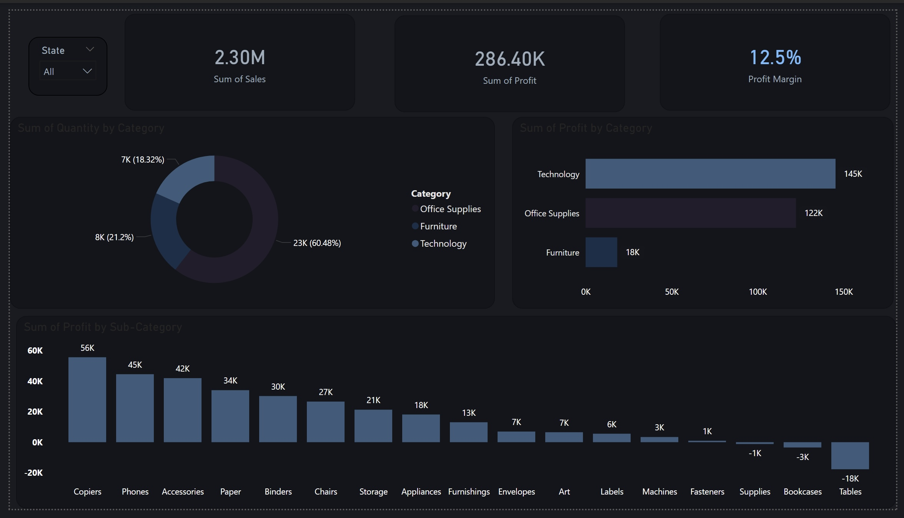
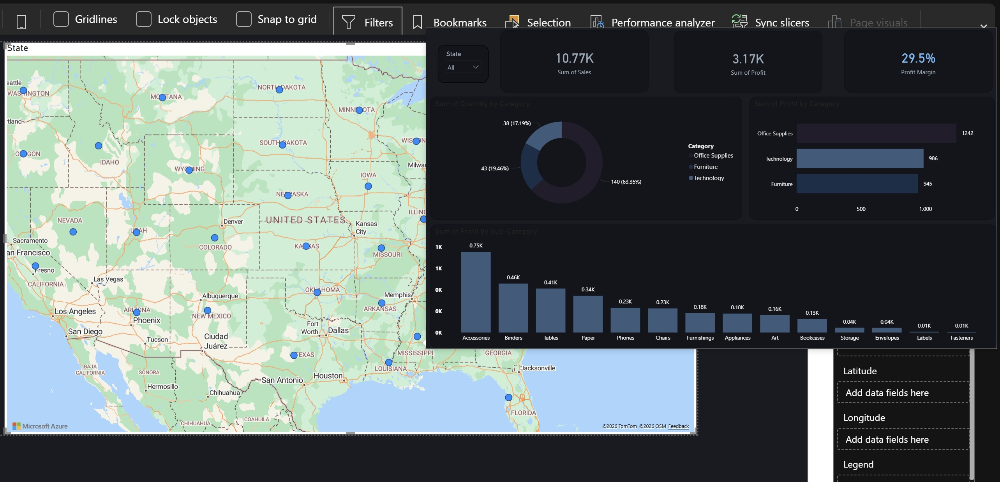

# Sales Performance Dashboard | Power BI

## ✦ Overview
This project presents an interactive sales dashboard built using Microsoft Power BI to analyze business performance across sales, profit, and product categories.
The dashboard enables stakeholders to track key metrics, identify profitable segments, and uncover underperforming areas.

---

## ✦ Business Problem
Companies often struggle to identify which products drive profitability and which contribute to losses.
This dashboard helps answer:
Which product categories generate the highest profit?
Where are the losses occurring?
How efficient is overall sales performance?

---

## ✦ Key Visualizations

• KPI Cards – Overview of Total Sales, Profit, and Profit Margin
• Quantity by Category – Distribution of sold products across categories
• Profit by Category – Profit comparison between main product categories
• Profit by Sub-Category – Detailed profitability analysis
• Geographic Sales Distribution – Sales performance across U.S. states

---

## ✦ Key Insights

- Technology category generated the highest profit.
- Some sub-categories such as Tables show negative profit.
- Overall profit margin is around 12.5%.

---
## ✦ Tools & Technologies
Microsoft Power BI
DAX (Data Analysis Expressions)

---

## ✦ Data Modeling
Data cleaned and structured for analysis
Measures created for Profit and Profit Margin
Efficient visual layout for decision-making

---

## ✦ Dashboard Preview

## Sales Map

---

## ✦ Future Improvements
Add time-based analysis (monthly/quarterly trends)
Include customer segmentation
Build a sales forecasting model

---

## › Dataset
The dataset used in this project was provided as a clean and ready-to-use dataset and is included in this repository.

---

## 🪄 Author
Ghala Althubaity

Linkedin: &nbsp; 
